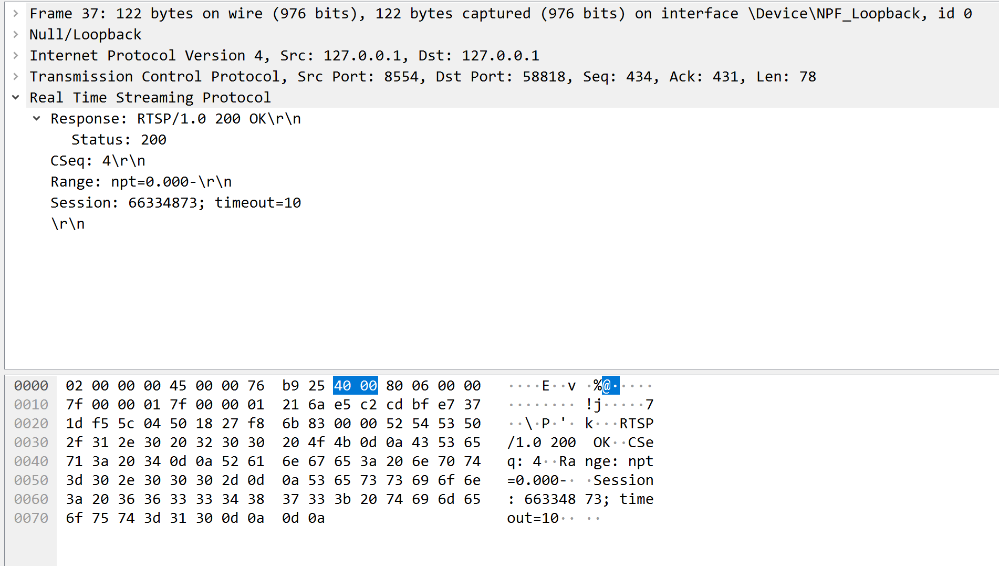

# 从零编写一个RTSP服务器 笔记

学习 B站 北小菜的《从零编写一个RTSP服务器》的课程， `https://www.bilibili.com/video/BV1xd4y147Fb`

示例代码：`https://gitee.com/Vanishi/BXC_RtspServer_study`

课程内容：

* 第一节：RTSP协议讲解及代码实现
* 第二节：实现一个基于UDP的RTP传输h264的RTSP服务器，并能够进行RTSP拉流播放
* 第三节：实现一个基于UDP的RTP传输aac的RTSP服务器，并能够进行RTSP拉流播放
* 第四节：实现一个基于TCP的RTP 同时传输h264和aac的RTSP服务器，并能够进行rtsp拉流播放
* 第五节：基于开源项目`BXC_RtspServer`进行详细的源码讲解，这是一个完整可用，支持多线程，基于socket编写的IO多路复用的RTSP流媒体服务器

## 第1节 RTSP协议讲解及代码实现

### RTSP协议简介

RTSP是一个实时传输流协议，是一个应用层的协议。通常说的RTSP 包括RTSP协议、RTP协议、RTCP协议，对于这些协议的左右简单的理解如下：

* RTSP协议：负责服务器与客户端之间的请求与相应
* RTP协议：负责服务器与客户端之间传输媒体数据
* RTCP协议：负责提供有关RTP传输质量的反馈，就是确保RTP传输的质量

三者的关系：

* rtp并不会发送媒体数据，只是完成服务器和客户端之间的信令交互，rtp协议负责媒体数据传输，rtcp负责rtp数据包的监视和反馈。
* rtp和rtcp并没有规定传输层的类型，可以选中udp和tcp。
* RTSP的传输层要求是基于tcp。

### 实例：演示RTSP的交互过程

通过一个ffmpeg客户端拉流播放一个rtsp视频流的发送，讲解一下RTSP的交互过程，并通过Wireshark抓包分析。

用到的工具包括：

* ffmpeg命令行
* wireshark

示例代码：`study1`

#### 抓包分析流程

1. 运行服务端代码：

   

2. 运行wireshark抓包软件

3. 运行 ffplay （当作客户端使用）：

   `ffplay -i rtsp://127.0.0.1:8554`

抓到的包


**rtsp流程分析：**

**1. `OPTIONS` 请求**

<font color=red>客户端向服务端请求数据时，首先发送`OPTIONS`请求。</font>

客户端在请求视频流之前，需要知道服务端支持哪些rtsp类型的方法，所以使用该请求获取相关信息。


* RTSP是基于tcp的，所以传输层使用tcp协议

* 该RTSP数据包的方法是`OPTIONS`

服务器返回的数据包


* 200表示请求成功
* Public：表示支持的方法，该服务端支持的方法有：
  * `OPTIONS` 
  * `DESCRIBE` ：流媒体数据的描述，如视频流的格式或编码等
  * `SETUP`：建立连接
  * `PLAY`：连接建立完后，通过`SETUP`建立的通道，源源不断的获取数据

**2. `DESCRIBE`**


返回的数据包


<font color=blue>SDP协议（会话描述协议）</font>

包括：

* 一个会话级描述
* 多个媒体级描述

简单介绍的一个文档：`https://blog.csdn.net/uianster/article/details/125902301`

> 客户端向服务器请求一个`DESCRIBE`时，服务器返回一个SDP数据时，会包含一个会话级描述和多个媒体级描述。
>
> 会话级描述：包含两者的ip、端口等一些建立连接的基本描述。
>
> 多个媒体级描述：如当前请求的流媒体资源包含音频和视频，那就是有两种流，两种流就有两个媒体级描述。

<font color=blue>SDP数据包字段的解释</font>

> 参考上面的博客文章，对应抓到的数据包

* media

  ```txt
  # media 必须
  m=<media><port><transport><fmt/payload type list>
  例子：m=audio 9 UDP/TLS/RTP/SAVPF 111 63 103 104 9 0 8 106 105 13 110 112 113 126
  ```

  对应的数据包：

  

  * media为 videos，代表这个媒体流为视频流
  * port为0：不同的使用场景，这个值赋予不同的含义：
    * rtsp使用SDP时，通常这个端口值设置为0，因为建立连接的端口是在`SETUP`方法里面指定的
    * 在国标协议里面传输rtp数据时，就需要指定rtp的端口
  * transport为`RTP/AVP`：表示传输类型
    * `RTP/AVP`：代表UDP类型（默认不加UDP）
    * TCP需要写为`RTP/AVP/TCP`
  * `fmt/payload type list` 为 96，表示它的负载类型

* rtpmap

  ```txt
  # rtpmap 可选（重要）
  a=rtpmap:<fmt/payload type><encoding name>/<clock rate>[/<encodingparameters>]
  例子：a=rtpmap:111 opus/48000/2
  ```

  对应的数据包：

  

  rtpmap表示一些媒体数据，H264表示他的编码，负载类型96，90000表示时钟频率

* control

  （博客里面没找到对应的字段格式）

  对应的数据包

  

  track0：表示这一路视频流的名称。用来区别不同的流，在`SETUP`建立流通道时会用到该值。

**3. `SETUP`**


为视频流`track0`建立请求连接通道。


* 使用的是UDP传输协议
* 端口号为`26340-26341`，每一路流都需要建立RTP和RTCP，就需要两个不同的端口

返回的数据包


* 返回了客户端端口和对应的服务端端口

  

* `session`对这次请求加了唯一的一个会话描述。

  不同的RTSP服务器`session`返回的时间节点可能不一样，也可以在第一次`OPTIONS`请求的返回包里面返回`session`的值，这取决于服务器的具体实现。

> 在客户端请求`SETUP`，服务端返回`SETUP`请求后，客户端和服务端会为两个端口建立两个连接，不同我们这边的服务器代码没有实现该步骤。

**4. `PLAY`**


在`SETUP`之后，就开始请求`PLAY`播放视频数据。


Range的值为`npt=0.000-` ： 表示一直播放，相当于直播类型的，没有结束的流媒体类型。

返回的数据包：




## 其他

### 下载ffmpeg

到`https://github.com/BtbN/FFmpeg-Builds/releases`下载一个编译好的命令行工具，并把目录添加到环境变量中。

